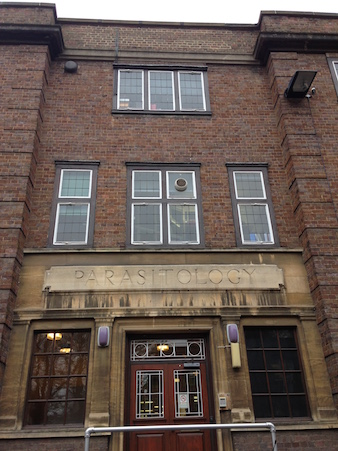

We are located in the historical Molteno building, in the heart of Cambridge University campus.

Our address is:

>Katerina Artavanis-Tsakonas, PhD, MPH  
>University Lecturer in Parasitology  
>Department of Pathology  
>University of Cambridge  
>Tennis Court Road  
>Cambridge,
>CB2 1QP

You can contact us via [email](mailto:ka447@cam.ac.uk) or phone: +44 (0)1223 764505
